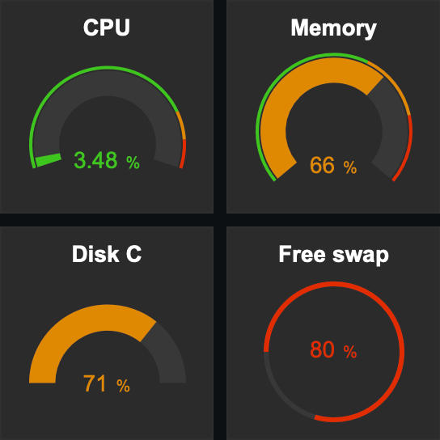

# Yeraz Zabbix Modules

A bunch of custom Zabbix modules.

# Notes

This modules has only tested with Zabbix 6.4.

# Gauge

A very simple gauge widget with a grafana look and feel and a lot of settings.

# Enhancer

Change dashboard settings like padding, margin and colors.

# Installation

* Copy only the each module folder (ex. **[yrzgauge](modules/)**) in your Zabbix modules directory (/usr/local/zabbix/modules)
* Go to the menu **Administration / General / Modules**
* Click on the button **Scan Directory** on the top right
* Click on the link **enabled** on the right of the module you added

Now you can use the widget in your dashboard.
